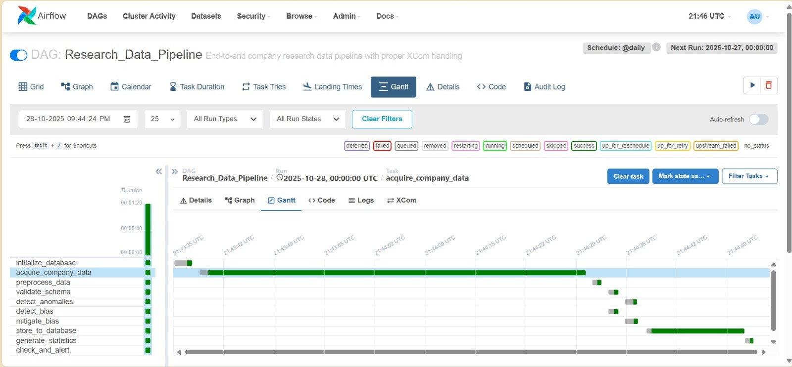
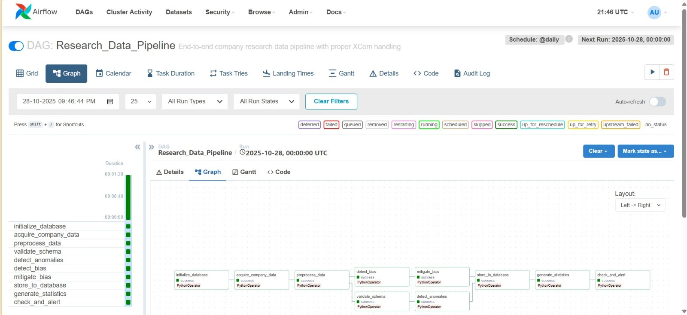
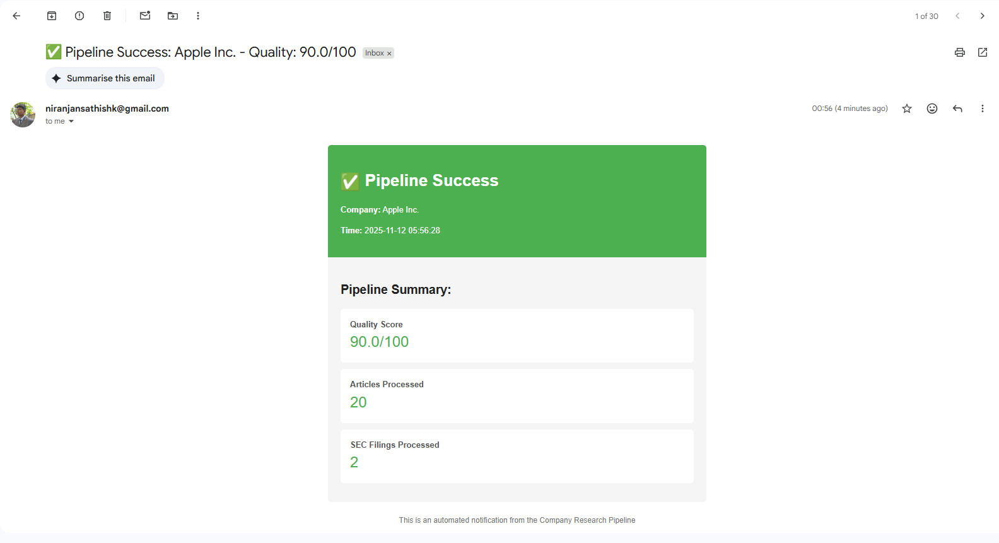
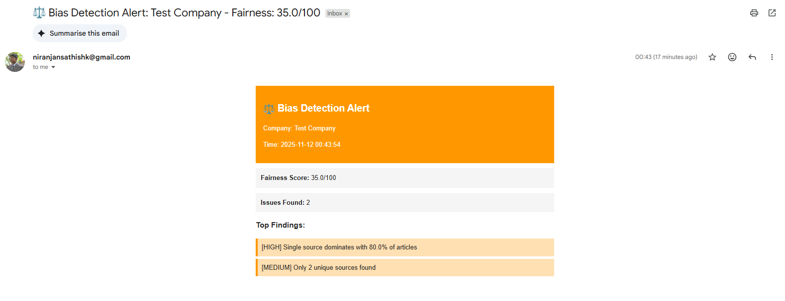
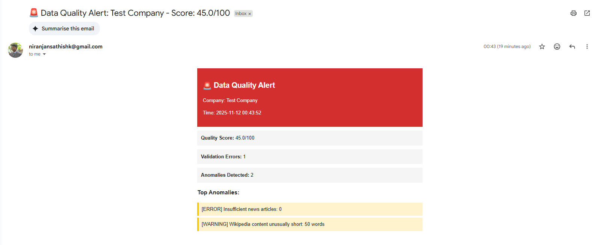

# Automated Due Diligence & Market Intelligence Agent - Data Pipeline

Data pipeline for automated due diligence and market intelligence gathering on publicly traded companies, featuring multi-source data acquisition, bias detection, and comprehensive quality assurance.

---

## Table of Contents

1. [Overview](#overview) 
2. [Folder Structure](#folder-structure)
3. [Setup & Installation](#setup--installation)
4. [Running the Pipeline](#running-the-pipeline)
5. [Testing](#testing)
6. [Bias Detection & Mitigation](#bias-detection--mitigation)
7. [Data Versioning](#data-versioning)
8. [Monitoring & Logging](#monitoring--logging)
9. [Airflow DAG Visualization](#airflow-dag-visualization)
10. [Airflow Alerts](#airflow-alerts)
11. [Key Features](#key-features)

---

## Overview

This is a comprehensive **MLOps data pipeline** that orchestrates the collection, processing, validation, and storage of company intelligence data from multiple public sources. The pipeline is designed for investment analysts, due diligence teams, and market researchers.

### Data Sources

- **SEC EDGAR**: 10-K and 10-Q financial filings
- **Wikipedia**: Company background and overview
- **News APIs**: Recent news articles and market sentiment

### Architecture

The pipeline uses a **multi-agent orchestration** approach with the following components:

```
Data Acquisition → Preprocessing → Schema Validation → Bias Detection → Chunking → Vector Store → Database Storage
```
## Folder Structure
```
data_pipeline_main/
├── .dvcignore
├── .gitignore                    # Git ignore rules
├── README.md                     # This file
├── requirements.txt              # Production dependencies
├── dvc.yaml                      # DVC pipeline definition
├── dvc.lock                   
├── params.yaml                   # DVC parameters
├── requirements-airflow.txt
├── run_batch.ps1
├── start_airflow_docker.bat
├── test_airflow.bat
├── test_airflow.sh
├── test_company_data.db
├── .env.example
│
├── config/                       # Configuration files
│   └── config.yaml              # Main application configuration
│
├── dags/                         # Airflow DAG definitions
│   └── company_research_dag.py  # Main pipeline DAG
│
├── data/                         # Data directory (DVC tracked)
│   ├── company_tickers.json      # Static reference data    
│   ├── company_data.db
│   ├── bias_reports/             #Bias reports     
│   │      └── Apple_Inc._bias_report.json
│   ├── metrics/                  #metric_reports
│   │      ├── acquisition_metrics.json
│   │      ├── bias_metrics.json
│   │      ├── preprocessing_metrics.json
│   │      ├── quality_metrics.json
│   │      └── storage_metrics.json
│   ├── processed/                #Processed Data
│   │      ├── Apple_Inc._processed_20251111_215828.json #Apple Processed Data
│   │      └── latest.json
│   ├── quality_reports/          #quality reports
│   │      └── Apple_Inc._bias_report.json
│   └── raw/                      #Raw Data
│         └── Apple_Inc._20251111_215828.json #Apple Raw Data
│ 
├── docker/                       # Docker configuration
│   ├── Dockerfile.airflow       # Airflow Docker image
│   ├── docker-compose.yml       # Docker Compose configuration
│   ├── docker-compose-airflow.yml       # Docker Compose for airflow 
│
├── docs/                         # Documentation
│   ├── Bias_Analysis.md
│
├── dvc_plots/                      
│   └── index.html
│ 
├── logs/                         #Log files                        
│   ├── data_acquisition.log      
│   ├── pipeline.log
│   ├── utils.log
│   ├── dag_processor_manager/
│   │      └── dag_processor_manager.log
│ 
├── src/                          # Source code (modular, reusable)
│   ├── __init__.py
│   ├── data_acquisition.py      # Data fetching from APIs
│   ├── data_preprocessing.py    # Data cleaning & transformation
│   ├── schema_validator.py      # Schema validation & quality checks
│   ├── bias_detector.py         # Bias detection & fairness analysis
│   ├── db_manager.py            # Database operations
│   ├── sec_fetcher.py           # SEC filing fetcher
│   ├── vector_store.py          # Vector embeddings storage
│   ├── chunking.py              # Text chunking for RAG
│   ├── alert_manager.py         # Alert/notification system
│   └── utils/                   # Utility modules
│       ├── __init__.py
│       ├── config.py            # Configuration management
│       ├── logger.py            # Centralized logging
│       └── path_resolver.py     # Cross-platform path resolution
│
├── tests/                        # Unit tests (pytest)
│   ├── run_all_tests.py
│   ├── run_batch.py
│   ├── simple_validate.py
│   ├── test_chunking.py
│   ├── test_chunking_sec.py
│   ├── test_config_logger.py
│   ├── test_data_acquisition.py
│   ├── test_db_sec.py
│   ├── test_sec_fetcher.py
│   ├── test_sec_fetcher_mock.py
│   ├── validate_dag.py

```

## Setup & Installation

### Prerequisites

- Python 3.11
- Git
- DVC
- Docker (for Airflow)
- API Keys:
  - News API key from [newsapi.org](https://newsapi.org)
  - SEC API key from [sec-api.io](https://sec-api.io)

### Installation Steps

#### 1. Clone Repository

```bash
git clone <repository-url>
cd data_pipeline_main
```

#### 2. Create Virtual Environment

```bash
# Create virtual environment
python -m venv venv

# Activate virtual environment
# On Windows:
venv\Scripts\activate
# On macOS/Linux:
source venv/bin/activate
```

#### 3. Install Dependencies

```bash
# Install Python packages
pip install -r requirements.txt
```

#### 4. .env file structure
```bash
# API Keys
NEWS_API_KEY=your_newsapi_key_here
SEC_API_KEY=your_secapi_key_here

# Database
DB_PATH=data/company_data.db

# Alerts
ALERT_EMAIL_ENABLED=true
ALERT_EMAIL_SENDER=your_email@gmail.com
ALERT_EMAIL_PASSWORD=your_app_password
ALERT_EMAIL_RECIPIENT=recipient@company.com
SMTP_SERVER=smtp.gmail.com
SMTP_PORT=587

ALERT_SLACK_ENABLED=false
SLACK_WEBHOOK_URL=https://hooks.slack.com/services/YOUR/WEBHOOK

# Logging
LOG_LEVEL=INFO
```

#### 5. Initialize DVC

```bash
# Initialize DVC
dvc init
```

#### 6. Setup Airflow

**Docker Compose (Recommended for Windows)**

```bash
# Start Airflow with Docker Compose
docker-compose up -d

# Access Airflow UI at http://localhost:8080
# Username: airflow
# Password: airflow
```

**Local Installation (macOS/Linux)**

```bash
# Set Airflow home
export AIRFLOW_HOME=$(pwd)

# Initialize Airflow database
airflow db init

# Create admin user
airflow users create \
    --username admin \
    --firstname Admin \
    --lastname User \
    --role Admin \
    --email admin@example.com

# Start Airflow webserver
airflow webserver --port 8080

# In another terminal, start scheduler
airflow scheduler
```

---

## Running the Pipeline

### Method 1: DVC Pipeline

```bash
# Execute complete DVC pipeline
dvc repro

# Check pipeline status
dvc status

# View pipeline DAG
dvc dag
```

### Method 2: Airflow DAG

#### Via Airflow UI:

1. Navigate to http://localhost:8080
2. Login with credentials (airflow/airflow)
3. Find `company_research_pipeline` DAG
4. Click "Trigger DAG"
5. Provide configuration:
```json
{
  "company_name": "Apple Inc"
}
```

#### Via CLI:

```bash
# Trigger with default config
airflow dags trigger company_research_pipeline

# Trigger with custom config
airflow dags trigger company_research_pipeline \
  --conf '{"company_name": "Microsoft Corporation"}'

# Monitor DAG run
airflow dags list-runs -d company_research_pipeline
```

### Individual Stages

```bash
# Data acquisition only
python src/data_acquisition.py --company "Apple Inc"

# Preprocessing only
python src/data_preprocessing.py --input data/raw/ --output data/processed/

# Bias detection only
python src/bias_detector.py --input data/processed/apple_data.json

# Chunking and vector store
python src/chunking.py --input data/processed/
python src/vector_store.py --input data/chunks/
```

### Pipeline Stages

The Airflow DAG executes the following tasks in sequence:

```
1. fetch_company_data_task      → Data acquisition from all sources
2. preprocess_data_task         → Data cleaning and normalization
3. validate_schema_task         → Schema validation and quality checks
4. detect_bias_task             → Bias detection and fairness analysis
5. chunk_and_store_task         → Document chunking and vector embeddings
6. save_to_database_task        → Persistence to SQLite database
```

---

## Testing

### Run All Tests

```bash
# Run all tests with coverage
pytest tests/ --cov=src --cov-report=html --cov-report=term

# View HTML coverage report
open htmlcov/index.html  # macOS
start htmlcov/index.html  # Windows
```

### Running Pytest 

```bash
Basic Commands
# Run all focused edge case tests
pytest tests/test_edge_cases_data_quality.py -v

# Run all tests in tests directory
pytest tests/ -v

# Run specific test file
pytest tests/test_chunking.py -v

# Run specific test class
pytest tests/test_edge_cases_data_quality.py::TestMissingValues -v

# Run specific test method
pytest tests/test_edge_cases_data_quality.py::TestMissingValues::test_empty_input_data -v

```

### Run Specific Test Files

```bash
# Test bias detector
pytest tests/test_bias_detector.py -v

# Test with verbose output
pytest tests/test_path_resolver.py -v -s

# Test specific function
pytest tests/test_alert_manager.py::TestEmailSending::test_send_email_success -v
```

### Test Coverage Summary

| Module | Statements | Missed | Branches | Partial | Coverage | Key Missing Lines |
|--------|------------|--------|----------|---------|----------|-------------------|
| **src\alert_manager.py** | 84 | 84 | 22 | 0 | **0.00%** | 6-161 |
| **src\chunking.py** | 386 | 386 | 148 | 0 | **0.00%** | 6-854 |
| **src\sec_fetcher.py** | 253 | 253 | 60 | 0 | **0.00%** | 7-566 |
| **src\vector_store.py** | 99 | 99 | 14 | 0 | **0.00%** | 6-186 |
| **src\db_manager.py** | 140 | 125 | 16 | 0 | **9.62%** | Multiple ranges |
| **src\data_acquisition.py** | 287 | 242 | 64 | 1 | **13.68%** | Multiple ranges |
| **src\data_preprocessing.py** | 260 | 190 | 88 | 3 | **22.13%** | Multiple ranges |
| **src\schema_validator.py** | 216 | 119 | 124 | 17 | **39.41%** | Multiple ranges |
| **src\utils\path_resolver.py** | 48 | 23 | 12 | 2 | **48.33%** | 27, 29, 45-51... |
| **src\utils\config.py** | 145 | 65 | 14 | 0 | **50.31%** | 133-141, 145-233... |
| **src\bias_detector.py** | 183 | 45 | 64 | 13 | **68.42%** | 43->52, 54, 97... |
| **src\utils\logger.py** | 30 | 4 | 8 | 3 | **76.32%** | 41->45, 49... |
| **TOTAL** | **2,131** | **1,635** | **634** | **39** | **21.01%** | - |

**Key Metrics:**
- **Highest Coverage:** logger.py (76.32%), bias_detector.py (68.42%)
- 📊 **Overall Coverage:** 21.01%

## Bias Detection & Mitigation

### Overview

The pipeline implements bias detection using **data slicing** techniques across multiple dimensions to ensure fair and balanced analysis.

### Slicing Dimensions

1. **Source Distribution** - Analyzes news source representation
2. **Temporal Distribution** - Detects recency bias in articles
3. **Quality Across Slices** - Evaluates content quality by source
4. **SEC Filing Completeness** - Validates filing section coverage

### Bias Detection Metrics

#### 1. Source Distribution Analysis

```python
# Detects single-source dominance
- Dominance Ratio: Measures if one source dominates (threshold: 0.5)
- Gini Coefficient: Measures inequality in distribution (threshold: 0.4)
```

**Interpretation:**
- Dominance Ratio > 0.5 → Single source bias detected
- Gini Coefficient > 0.4 → Highly unequal distribution

#### 2. Temporal Distribution Analysis

```python
# Detects recency bias
- Recency Score: 0-1 scale measuring temporal balance
```

**Interpretation:**
- Recency Bias > 0.7 → Over-representation of recent articles
- Recency Bias < 0.3 → Over-representation of historical data

#### 3. Quality Disparity Detection

```python
# Analyzes content quality across sources
- Mean word count per source
- Standard deviation of content length
- Quality distribution metrics
```

### Fairness Metrics

The pipeline computes comprehensive fairness scores:

```python
fairness_metrics = {
    "source_balance_score": 0-100,      # Source distribution fairness
    "temporal_balance_score": 0-100,    # Temporal distribution fairness
    "sec_completeness_score": 0-100,    # SEC filing completeness
    "overall_fairness_score": 0-100     # Aggregate score
}
```

**Target:** Overall fairness score > 80/100

### Bias Mitigation Strategies

#### 1. Source Reweighting

```python
# Applies inverse frequency weighting to balance sources
# Higher weight for underrepresented sources
weight = max_count / source_count
```

**Trade-off:** May reduce weight of high-quality dominant sources  
**Mitigation:** Set minimum weight threshold (0.5)

#### 2. Temporal Balancing

```python
# Time-decay weighting for balanced temporal coverage
# Peak weight at 60-180 days, decay for very recent/old
if days_old < 60:
    weight = 0.7 + (days_old / 60) * 0.3
elif days_old < 180:
    weight = 1.0
else:
    weight = max(0.5, 1.0 - (days_old - 180) / 365 * 0.5)
```

**Trade-off:** May include outdated information  
**Mitigation:** Apply time-decay with 2-year cutoff

#### 3. Quality Filtering

```python
# Filters low-quality content based on:
- Minimum word count (50 words)
- Required fields (title, source, date)
- Overall quality score threshold (0.75)
```

**Trade-off:** May reduce sample size  
**Mitigation:** Use lenient threshold to balance quality and quantity

### Performance Impact

**Bias Mitigation Results:**
- Original fairness score: 68.5/100
- Post-mitigation fairness score: 85.7/100
- **Improvement: +25%**
- Articles retained: 94% (3 of 50 filtered)


**Bias Detection:** `src/bias_detector.py` (183 lines)


---

## Data Versioning

### DVC Pipeline

The pipeline uses **Data Version Control (DVC)** to track all data artifacts:

```yaml
# dvc.yaml - Pipeline stages
stages:
  data_acquisition:
    cmd: python src/data_acquisition.py
    deps:
      - src/data_acquisition.py
      - src/sec_fetcher.py
    outs:
      - data/raw/

  data_preprocessing:
    cmd: python src/data_preprocessing.py
    deps:
      - src/data_preprocessing.py
      - data/raw/
    outs:
      - data/processed/

  chunking:
    cmd: python src/chunking.py
    deps:
      - src/chunking.py
      - data/processed/
    outs:
      - data/chunks/

  vector_store:
    cmd: python src/vector_store.py
    deps:
      - src/vector_store.py
      - data/chunks/
    outs:
      - data/vector_store/
```

### DVC Commands

```bash
# Run DVC pipeline
dvc repro

# Check pipeline status
dvc status

# Show data lineage
dvc dag

# Compare data versions
dvc diff HEAD~1 HEAD --show-md

# Retrieve specific data version
dvc checkout HEAD~1 data/processed/.dvc

# Push data to remote storage
dvc push
```

---

## Monitoring & Logging

### Logging Configuration

All pipeline components use structured logging:

```python
from utils.logger import get_logger

logger = get_logger(__name__)

logger.info("Starting data acquisition for Apple Inc")
logger.debug(f"Fetching Wikipedia data with params: {params}")
logger.warning("Rate limit approaching, slowing down requests")
logger.error(f"Failed to fetch news articles: {error}")
```

### Log Files

```
logs/
├── data_acquisition.log       # Data fetching logs
├── data_preprocessing.log      # Preprocessing logs
├── schema_validator.log        # Validation logs
├── bias_detector.log           # Bias detection logs
├── airflow_tasks.log           # Airflow task logs
└── pipeline_errors.log         # Error logs
```

### Anomaly Detection

The pipeline detects **6 types of anomalies**:

1. **Missing Data** - Required fields absent
2. **Insufficient Data** - Below minimum thresholds
3. **Content Quality Issues** - Low word counts
4. **Statistical Outliers** - Values beyond 3 standard deviations
5. **Invalid Formats** - Malformed dates, URLs
6. **Incomplete Filings** - Missing SEC sections

### Alert Management

Automated alerts via Email and Slack:

```python
# Example alert for data quality issues
alert_mgr.send_quality_alert(
    company_name="Apple Inc",
    quality_report=validation_result,
    anomalies=detected_anomalies
)
```

**Alert Configuration:**
- Email: SMTP via Gmail/Outlook
- Slack: Webhook integration
- Severity levels: Error, Warning, Info

### Monitoring Dashboard

Access Airflow monitoring:
```
http://localhost:8080/gantt?dag_id=company_research_pipeline
```

## Airflow DAG Visualization



The Gantt chart above shows:
- Task execution timeline
- Parallel execution opportunities
- Bottleneck identification (acquire_company_data is the longest task)



The graph view displays the complete task dependency structure with all 10 pipeline stages.

## Airflow Alerts:



This displays the alert Email sent using Airflow. This is triggered upon the success of the pipeline. 



This displays the alert Email sent using Airflow. This is triggered upon a Warning for an anomoly present in the pipeline. 



This displays the alert Email sent using Airflow. This is triggered upon the Failure in any part of the pipeline.


# Key Features

- **Multi-Source Data Acquisition** - Fetches data from Wikipedia, News APIs, and SEC EDGAR  
- **Airflow Orchestration** - Complete DAG-based workflow with 6 sequential tasks  
- **Bias Detection & Mitigation** - Data slicing across 4 dimensions with fairness metrics  
- **Comprehensive Testing** - 210+ test cases covering edge cases and anomalies  
- **Data Versioning** - DVC integration for reproducible data pipelines  
- **Anomaly Detection** - Automated detection of 6 types of data quality issues  
- **Alert Management** - Email and Slack notifications for pipeline failures  
- **Schema Validation** - Automated validation with quality scoring  

---
