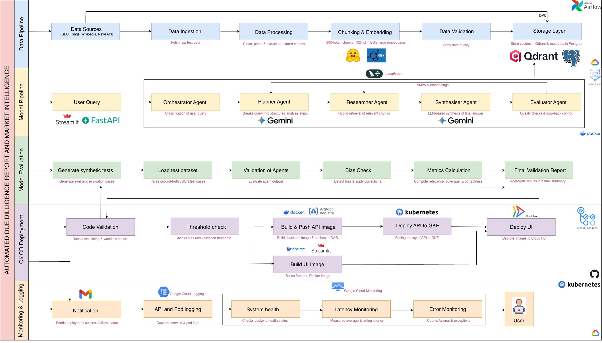
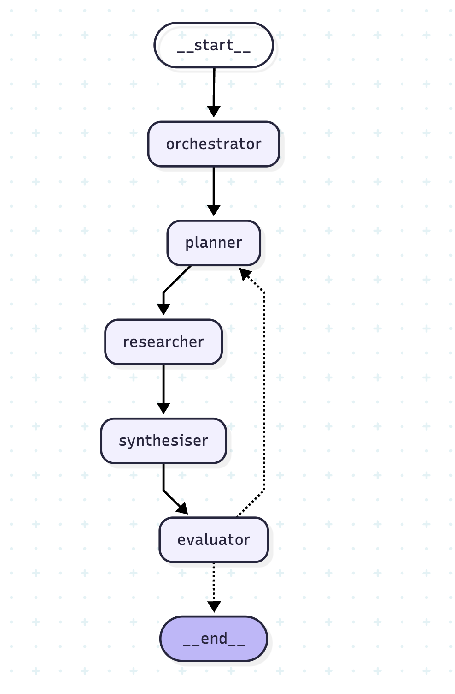
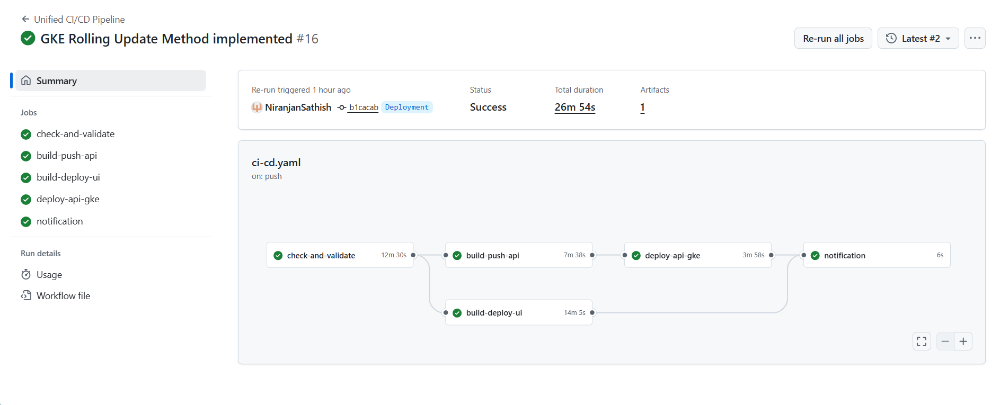
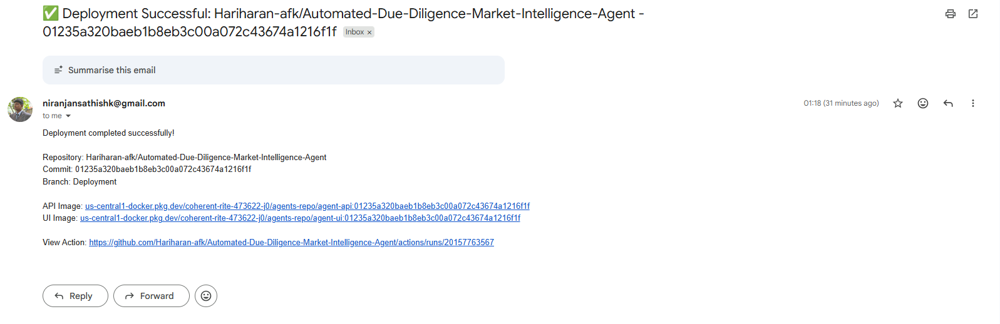
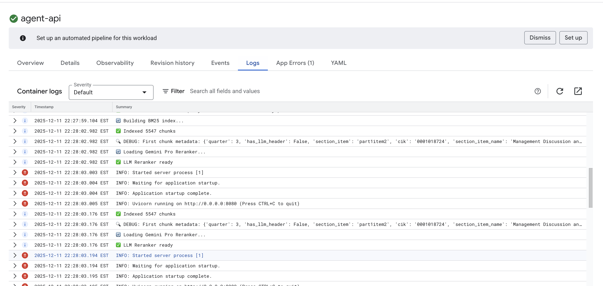

#  Market Due Diligence AI Agent

A production-grade, autonomous multi-agent system for financial analysis, powered by **LangGraph**, **FastAPI**, **Streamlit**, and **Google Vertex AI**. [Try it out!](https://agent-ui-185914940359.us-central1.run.app/)



---

## 📋 Table of Contents
1. [The Problem We're Solving](#problem)
2. [Our Solution: The Agent Network](#solution)
3. [The 5 AI Agents Explained](#agents)
4. [How Information Flows Through The System](#flow)
5. [The Intelligence Behind Search](#search)
6. [Why We Use Multiple AI Models](#models)
7. [Data Pipeline](#data-pipeline)
8. [The User Experience](#ui)
9. [System Monitoring & Quality Control](#monitoring)
10. [Architecture & Tech Stack](#architecture)
11. [Project Structure](#structure)
12. [Installation Guide](#installation)
13. [Setup & Local Development](#setup)
14. [Deployment Automation & CI/CD](#cicd)
15. [GitHub Secrets Configuration](#secrets)
16. [Cloud Deployment Strategy](#deployment)
17. [Verifying Deployment](#verifying)
18. [Cost & Performance](#cost)
19. [Troubleshooting](#troubleshooting)

---
## <a name="problem"></a> 1. The Problem We're Solving

### The Challenge with Traditional AI Financial Analysis

When you ask a standard AI chatbot like ChatGPT "What was Tesla's Q3 2024 revenue?", here's what typically happens:

**❌ The Old Way (Single LLM)**:
```
User asks question
    ↓
AI "thinks" and generates an answer from memory
    ↓
Answer: "$25.2 billion" (but is this real or hallucinated?)
```

**Problems**:
- **Hallucination**: The AI might make up numbers that sound plausible
- **No Sources**: Where did that number come from? We don't know
- **Outdated**: Training data might be months or years old
- **Inconsistent**: Ask the same question twice, get different answers

### Why This Matters in Finance

In financial analysis, accuracy isn't optional—it's critical. A wrong number can lead to:
- Poor investment decisions
- Regulatory compliance issues  
- Loss of client trust
- Legal liability

**Our Solution**: Instead of asking one AI to "know everything," we built a team of specialized AI agents that work together to research, verify, and cite their sources—just like a human analyst would.

---

## <a name="solution"></a> 2. Our Solution: The Agent Network

### The Core Concept: Division of Labor

Think of our system like a professional research firm where each person has a specific role:

**Traditional AI** = One person trying to do everything
**Our Agentic AI** = A coordinated team of specialists

### The Team Structure

```
                    ┌─────────────────┐
                    │   The Client    │
                    │  (Your Question)│
                    └────────┬────────┘
                             │
                             ▼
        ┌────────────────────────────────────────┐
        │      🧠 The Manager (Orchestrator)     │
        │  "Is this a financial research task?"  │
        └────────────────┬───────────────────────┘
                         │ YES
                         ▼
        ┌────────────────────────────────────────┐
        │      📅 The Strategist (Planner)       │
        │ "Let's break this into specific tasks" │
        └────────────────┬───────────────────────┘
                         │ Task List
                         ▼
        ┌────────────────────────────────────────┐
        │    🔎 The Researcher (Researcher)      │
        │ "I'll find the actual documents"       │
        └────────────────┬───────────────────────┘
                         │ Raw Data
                         ▼
        ┌────────────────────────────────────────┐
        │     📝 The Analyst (Synthesiser)       │
        │ "I'll write a professional report"     │
        └────────────────┬───────────────────────┘
                         │ Draft Report
                         ▼
        ┌────────────────────────────────────────┐
        │      ⚖️ The Auditor (Evaluator)        │
        │ "Let me fact-check this answer"        │
        └────────────────┬───────────────────────┘
                         │
                    ┌────┴────┐
                    │         │
                 APPROVE   REJECT
                    │         │
                    ▼         ▼
            ┌──────────┐  ┌─────────────┐
            │ Deliver  │  │ Try Again   │
            │ to User  │  │ (with hints)│
            └──────────┘  └─────────────┘
```

### Why This Works Better

**Single Agent Approach**:
- Tries to remember everything → Makes mistakes
- No verification → Hallucinations slip through
- One shot answer → Can't self-correct

**Multi-Agent Approach** (Our System):
- Specialization → Each agent is expert at one thing
- Built-in verification → Evaluator catches errors
- Feedback loops → Can retry with better strategy
- Full transparency → Every claim has a source

---

## <a name="agents"></a> 3. The 5 AI Agents Explained

Let me introduce each member of our AI team and explain what they do, why they're necessary, and how they think.

---

### 3.1  The Orchestrator: Your Intake Specialist

**Role**: First point of contact - determines if this needs the full research team

**Think of it like**: A law firm's receptionist who decides if your call needs a partner, associate, or just a quick answer

**What it does**:
1. Reads your question
2. Classifies the intent: Is this financial? General chat? Risk analysis?
3. Determines complexity: Simple fact? Complex research?
4. Routes to appropriate workflow

**Real-World Example**:
- **Input**: "What's EBITDA?"
- **Decision**: Simple definition → Direct answer (skip research)
- **Input**: "Compare Ford and GM's debt ratios"
- **Decision**: Complex financial → Full research pipeline

**Why it matters**: Saves money and time by not over-processing simple questions. If someone says "Thank you" or "Hello," we don't need to search through thousands of SEC filings.

**Configuration**: Uses the AI with strictest settings (Temperature: 0.1) to ensure consistent routing

---

### 3.2  The Planner: Your Research Strategist

**Role**: Breaks down complex questions into specific, searchable tasks

**Think of it like**: A project manager who takes "Build a house" and creates a detailed task list: "Pour foundation," "Frame walls," "Install plumbing," etc.

**What it does**:
1. Takes your broad question
2. Identifies what data points are needed
3. Creates specific search queries
4. If the first attempt fails, reads feedback and adjusts the plan

**Real-World Example**:

**Your question**: "How did Apple perform compared to Microsoft in 2024?"

**The Planner's breakdown**:
1. "Apple total revenue fiscal year 2024"
2. "Microsoft total revenue fiscal year 2024"  
3. "Apple net profit margin 2024"
4. "Microsoft net profit margin 2024"
5. "Apple vs Microsoft market capitalization 2024"

**Why these specific queries?**: Each targets ONE piece of data from ONE source. This precision makes the Researcher's job easier and results more accurate.

**Self-Correction Feature**:
If the Evaluator later says "You're missing Q3 data," the Planner will generate NEW queries specifically targeting Q3 numbers. This is like a project manager adjusting the plan based on QA feedback.

**Configuration**: Uses slightly creative AI settings (Temperature: 0.3) to think of diverse search angles

---

### 3.3  The Researcher: Your Data Detective

**Role**: Finds the actual source documents and ranks them by relevance

**Think of it like**: A law clerk searching through case law, except instead of just finding documents, they also highlight the most relevant paragraphs

**What it does** (The 4-Stage Process):

**Stage 1: Cast a Wide Net**
- For each sub-query from the Planner, search in two ways simultaneously:
  - **Semantic Search** (Meaning-based): "Find documents about profitability" matches "operating margin," "net income," etc.
  - **Keyword Search** (Exact-match): "Form 10-K" only matches documents containing that exact phrase
- This dual approach catches both conceptual matches and specific terms

**Stage 2: Pool the Results**
- Collect all findings from all sub-queries
- Typical result: 50-100 document chunks

**Stage 3: Remove Duplicates**
- If "Apple revenue" and "Apple Q3 earnings" both found the same paragraph, keep only one copy

**Stage 4: Intelligent Ranking** (The Secret Sauce)
- Send the entire pool to an AI and ask: "Given the original question, rank these 50 chunks from most to least relevant"
- Keep only the top 20 most relevant chunks
- This eliminates noise and focuses on signal

**Why this multi-stage approach?**:
- Wide net ensures we don't miss anything
- Dual search (semantic + keyword) catches different types of information
- AI reranking uses the actual question context to prioritize results

**Real-World Analogy**:
Imagine researching "Best Italian restaurants in New York":
- **Keyword search**: Finds pages with exact phrase "Italian restaurant New York"  
- **Semantic search**: Also finds "authentic pasta in Manhattan," "top trattorias NYC," etc.
- **Reranking**: AI reads all 50 results and picks the 20 most likely to be useful

**Data Sources**:
- SEC Filings (10-K, 10-Q, 8-K)
- Financial news articles
- Wikipedia (for background context)

**Configuration**: Uses precise AI settings (Temperature: 0.2) focused on accuracy

---

### 3.4  The Synthesiser: Your Financial Analyst

**Role**: Writes a professional report using ONLY the research data provided

**Think of it like**: A financial analyst who must write a report but can only use the documents in front of them—no outside knowledge allowed

**What it does**:
1. Receives your question + the top 20 research chunks
2. Reads through all the data
3. Writes a structured report with specific sections
4. Cites every claim with source references

**The Report Structure** (Automatically enforced):

```
 Executive Summary
A 2-3 sentence high-level answer

 Key Findings
• Bullet points with the most important numbers
• Each bullet has a [Source: ...] citation

 Detailed Analysis  
In-depth explanation with context and trends

 Data Gaps (only if necessary)
"Note: Q2 data was not available in the sources"
```

**The Golden Rule**: **ONLY use provided data**

If the research chunks don't contain a specific number, the Synthesiser CANNOT use it—even if the AI "knows" it from training. This rule prevents hallucination.

**Example of Enforcement**:

**Research Data Contains**: "Apple reported revenue of $94.9 billion in Q3 2024"

**✅ Allowed**: "Apple's Q3 2024 revenue was **$94.9 billion** [Source: Apple 10-Q Aug 2024]"

**❌ Not Allowed**: "Apple's Q3 2024 revenue grew 8% YoY" (if the 8% growth rate isn't in the chunks)

**Why Professional Structure?**: Financial stakeholders expect specific formats. The enforced structure ensures consistency and completeness.

**Configuration**: Uses precise AI settings (Temperature: 0.2) for consistent professional tone

---

### 3.5  The Evaluator: Your Quality Auditor

**Role**: Fact-checks the report before delivery and decides if it's good enough

**Think of it like**: A senior partner reviewing an associate's work before it goes to the client

**What it does**:
1. Receives the draft report + original research chunks
2. Performs two critical checks:
   - **Hallucination Detection**: "Are all claims supported by the source documents?"
   - **Completeness Check**: "Did we actually answer the user's question?"
3. Assigns a quality score
4. Makes a decision: APPROVE or REJECT

**The Decision Logic**:

**Hallucination Score** (0.0 to 1.0):
- 0.0 = Perfect, every claim is backed by sources  
- 0.3 = Threshold for concern
- 1.0 = Severe hallucination, many unsupported claims

**If Score < 0.3 AND question answered**: ✅ **APPROVE** → Send to user

**If Score ≥ 0.3 OR question not answered**: ❌ **REJECT** → Send back to Planner with specific feedback

**Example Rejection Feedback**:
"The answer is missing Q3 2024 data. The user specifically asked for Q3. Please create new sub-queries targeting Q3 10-Q filing."

**The Retry Loop**:
- Planner receives this feedback
- Generates new, improved search queries
- Researcher searches again  
- Synthesiser writes new report
- Evaluator checks again

**Safety Limit**: Maximum 2 iterations (1 retry) to prevent infinite loops

**Why This Is Crucial**: 
This is our last line of defense against AI hallucination. Even if the Synthesiser accidentally includes unsupported data, the Evaluator catches it before the user sees it.

**Configuration**: Uses the strictest AI settings (Temperature: 0.1) for consistent, rigorous checking

---

## <a name="flow"></a>🔄 4. How Information Flows Through The System

### The Complete Journey of a Query

Let's trace what happens when you ask: **"What were Tesla's key risk factors in 2024?"**

**Step 1: Entry (Orchestrator)**
```
Input: "What were Tesla's key risk factors in 2024?"
↓
Analysis: This is a financial research task (not casual chat)
Complexity: Complex (needs document research)
↓
Decision: Route to full pipeline
```

**Step 2: Strategy (Planner)**
```
Task: Break down the question
↓
Sub-Queries Generated:
1. "Tesla Form 10-K 2024 risk factors section"
2. "Tesla 2024 regulatory risks"
3. "Tesla 2024 supply chain risks"  
4. "Tesla 2024 competitive risks"
↓
Output: 4 specific search tasks
```

**Step 3: Research (Researcher)**
```
For each sub-query:
  - Search SEC database (semantic + keyword)
  - Search news archives
  - Collect candidates (20 per query = 80 total)
↓
Deduplicate: 80 → 65 unique chunks
↓
AI Reranking: "Which 20 chunks best answer the original question?"
↓
Output: Top 20 most relevant paragraphs
```

**Step 4: Report Writing (Synthesiser)**
```
Input: Original question + 20 research chunks
↓
Process:
- Read all chunks
- Extract key risk themes
- Structure into professional report
- Add [Source: ...] citations
↓
Output: 
"**Executive Summary**: Tesla's 2024 Form 10-K identified
several material risks including battery supply constraints
[Source: Tesla 10-K Item 1A]..."
```

**Step 5: Quality Check (Evaluator)**
```
Review Process:
✓ Check claim: "battery supply constraints"
  - Found in chunk #3: ✅ PASS
✓ Check claim: "regulatory uncertainty in China"  
  - Found in chunk #7: ✅ PASS
✓ Check completeness: Did we answer "key risk factors"?
  - Yes, identified 5 major risks: ✅ PASS
↓
Hallucination Score: 0.05 (very low)
Confidence: 0.91 (high)
↓
Decision: ✅ APPROVE
```

**Step 6: Delivery**
```
Return to user with:
- Professional report
- Source citations  
- Metadata (timing, confidence scores)
```

### The Retry Scenario

**What if the Evaluator rejects?**

Example: Evaluator finds the report is missing "2024 Q4 risks" but only covered annual risks.

**Rejection Flow**:
```
Evaluator → Planner: 
"REJECT: Missing Q4-specific risks. 
 Feedback: Search for Tesla 10-Q Q4 2024 risk updates"
    ↓
Planner generates NEW sub-queries:
- "Tesla Q4 2024 10-Q risk factors"
- "Tesla October-December 2024 regulatory updates"
    ↓
Researcher searches AGAIN with new queries
    ↓
Synthesiser writes IMPROVED report
    ↓
Evaluator checks AGAIN
```

This self-correction mechanism is what separates our system from simple chatbots.

---

## <a name="search"></a> 5. The Intelligence Behind Search

### Why "Hybrid Search" is Our Secret Weapon

Most AI systems use only one search method. We use TWO simultaneously and combine them.

### Method 1: Semantic Search (Meaning-Based)

**How it works**:
1. Convert your question into a 768-dimensional vector (a list of 768 numbers)
2. Convert every document chunk into the same format
3. Find chunks whose vectors are "close" to the question vector
4. "Close" = similar meaning

**Real-World Example**:

Your question: "Tesla profitability"

**Semantic search finds**:
- "operating margin increased to 18%"  ← No exact word match, but same concept
- "net income grew 45% year-over-year" ← Profitability = income growth
- "gross profit reached $25 billion" ← Another profitability metric

**Why it's powerful**: Catches concepts and synonyms, not just exact words

**Limitation**: Sometimes too broad, might find tangentially related content

---

### Method 2: Keyword Search (Exact Match)

**How it works**:
Uses BM25 algorithm (industry standard for keyword search):
1. Tokenize your question: ["Tesla", "profitability"]
2. Find documents containing these exact terms
3. Rank by term frequency and uniqueness

**Real-World Example**:

Your question: "Form 10-K Item 1A"

**Keyword search finds**:
- Documents with exact phrase "Form 10-K"  
- Sections labeled "Item 1A"
- Tesla 10-K filing metadata

**Why it's powerful**: Perfect for finding specific document types, section numbers, or technical terms

**Limitation**: Misses conceptually related content without exact words

---

### The Hybrid Fusion

We combine both methods using a weighted average:

```
Final Score = (0.7 × Semantic Score) + (0.3 × Keyword Score)
```

**Why 70/30 split?**:
- Semantic search is usually more important (captures meaning)
- Keyword search adds precision (catches specific terms)
- This ratio was tuned through testing

**Real Result**:

Question: "Tesla Q3 2024 revenue growth"

| Document Chunk | Semantic Score | Keyword Score | Final Score |
|:--------------|:---------------|:--------------|:-----------|
| "Tesla Q3 revenue rose 8%" | 0.92 | 0.95 | **0.925**  |
| "Tesla discussed Q3 performance" | 0.78 | 0.85 | **0.801**  |
| "Automotive revenue quarterly" | 0.71 | 0.23 | **0.566** |

The first chunk wins because it has BOTH high semantic relevance AND exact keyword matches.

---

### The Final Reranking Step

After hybrid search gives us 50 chunks, we use AI to rerank them:

**Why?**: The AI can read the ORIGINAL question and ALL chunks together to make holistic relevance judgments

**Example**:

Original question: "What caused Tesla's stock drop in October 2024?"

Chunk A: "Tesla stock fell 12% on October 15, 2024"  
Chunk B: "Analysts cited production delays as primary concern"  
Chunk C: "Tesla announced price cuts in China market"

**Hybrid search scores might rank**: A > C > B  
**AI reranking recognizes**: B is most relevant because it explains the CAUSE

This contextual understanding is why we use AI for the final ranking.

---

## <a name="models"></a> 6. Why We Use Multiple AI Models

### The Two-Model Strategy

**Model 1: Gemini 2.5 Pro** (The Brain)
- **Used by**: All 5 agents  
- **Role**: Reasoning, planning, writing, evaluation
- **Strengths**: Deep contextual understanding, long context window (1M tokens)
- **Cost**: $0.00125 per 1K input tokens, $0.005 per 1K output tokens

**Model 2: text-embedding-004** (The Librarian)
- **Used by**: Researcher (for semantic search)
- **Role**: Converting text into 768-dimensional vectors
- **Strengths**: Fast, cheap, optimized for retrieval
- **Cost**: $0.000025 per 1K characters

### Why Not Use One Model for Everything?

**Analogy**: You wouldn't ask Einstein to organize your filing cabinet, and you wouldn't ask a librarian to solve physics equations.

**Gemini for Reasoning**:
- Can understand nuanced questions
- Generates coherent long-form text  
- Makes judgment calls (approve vs reject)

**text-embedding-004 for Search**:
- Specifically trained to create good search vectors
- 10x faster than Gemini for embeddings
- 200x cheaper for this specific task

### The 768-Dimension Requirement

**What does "768 dimensions" mean?**

When we convert text to vectors for search:
- Old models: 384 dimensions → less precise
- Our model: 768 dimensions → higher precision
- Some newer models: 1024+ dimensions → even better but incompatible with our database

**Why we're locked to 768**: Our vector database (Qdrant) has 5,000+ documents already indexed at 768 dimensions. Changing would require re-indexing everything (expensive and time-consuming).

---

## <a name="data-pipeline"></a> 7. Data Pipeline (Refer [Data Pipeline Branch](https://github.com/Hariharan-afk/Automated-Due-Diligence-Market-Intelligence-Agent/tree/Data_Pipeline))

### 1. Overview and Data Flow

This Data Pipeline is the backbone of the Market Intelligence Agent, responsible for continuously ingesting, processing, and storing financial data from multiple sources to power downstream RAG (Retrieval-Augmented Generation) applications.

### Key Capabilities
*   **Multi-Source Ingestion**: Fetches data from SEC Filings (10-K/10-Q), Wikipedia, and Global News (NewsAPI + GDELT).
*   **Advanced Processing**:
    *   **Full Document Processing**: Handles complete SEC filings, not just summaries.
    *   **Table Intelligence**: Identifies tables in SEC filings, summarizes them using LLMs (Groq), and creates separation between text and tabular data for better retrieval.
    *   **Smart Chunking**: Uses recursive character splitting with overlap to create context-aware chunks.
    *   **Embedding**: Generates high-quality vector embeddings using `BAAI/bge-large-en-v1.5`.
*   **Bias Mitigation**: Tracks data coverage per company and applies boosting factors during retrieval to ensure fair representation of smaller companies.
*   **Robust Storage**:
    *   **Google Cloud Storage (GCS)**: Stores raw processed JSON data for audit and backup.
    *   **Qdrant**: Stores vector embeddings with rich metadata for semantic search.
    *   **PostgreSQL**: Tracks the processing state of every filing and article to prevent duplicates and monitor pipeline health.

### Data Flow
1.  **Ingestion**: Airflow DAGs trigger fetchers (`SECFetcher`, `NewsFetcher`, `WikipediaFetcher`) based on `companies.yaml`.
2.  **Processing**:
    *   Text is cleaned and normalized.
    *   Tables are extracted, summarized, and replaced with placeholders in the text.
    *   Content is chunked into manageable sizes (e.g., 1024 tokens).
3.  **Embedding**: Chunks and table summaries are passed through the Embedding Model to generate vectors.
4.  **Storage**:
    *   Raw data (chunks + metadata) -> Uploaded to GCS.
    *   Vectors -> Uploaded to Qdrant.
    *   Job Status -> Updated in PostgreSQL.
5.  **Validation**: Data availability and quality are verified using `DataValidator`.

---

## <a name="ui"></a> 8. The User Experience

### Two Interfaces for Two Audiences

#### 7.1 User Chat Interface (For Analysts)

**What you see**:
```
┌─────────────────────────────────────────┐
│  💬 New Chat Session                    │
├─────────────────────────────────────────┤
│                                         │
│  You: What was Apple's Q3 revenue?      │
│                                         │
│  🤖 AI: Let me research that...         │
│      [Thinking: 15.2 seconds]           │
│                                         │
│  **Executive Summary**                  │
│  Apple reported **$89.5 billion** in... │
│  [Source: Apple 10-Q Aug 2024]          │
│                                         │
└─────────────────────────────────────────┘
```

**Features**:
- Multiple chat sessions (like ChatGPT tabs)
- Real-time streaming responses  
- Source citations clickable
- Interrupted request recovery (if connection drops midway)

**Session Management**: Each conversation gets a unique ID and is saved, so you can return to past analyses

---

#### 7.2 Admin Dashboard (For DevOps/Management)

**Login**: Username: `admin`, Password: `admin`

**Three Monitoring Tabs**:

**Tab 1: 💰 Cost & Tokens**
```
┌──────────────────────────────────┐
│ Total Requests: 47               │
│ Total Tokens: 583,451            │
│ Estimated Cost: $1.75            │
├──────────────────────────────────┤
│ Average per query:               │
│ - Tokens: ~12,400                │
│ - Cost: $0.037                   │
└──────────────────────────────────┘
```

**Tab 2: ⏱️ Latency Breakdown** (Pie Chart)
```
Where does the time go?
- Researcher: 52%  (15.7 sec average)
- Synthesiser: 27% (8.1 sec)
- Planner: 8%      (2.3 sec)
- Evaluator: 11%   (3.4 sec)
- Orchestrator: 2% (1.2 sec)
```

**Tab 3: 📊 Performance Metrics**
```
RAG Quality:
- Average chunks retrieved: 18.2
- Retrieval hit rate: 94%
- Hallucination score: 0.08 (low is good)
```

**Why this matters**: Helps you optimize costs (if Synthesiser is slow, we can tune its settings) or identify issues (low hit rate means our data might be outdated)

---

## <a name="monitoring"></a>📊 9. System Monitoring & Quality Control

### How We Track Quality

Every query generates detailed metrics automatically:

**Timing Metrics** (helps optimize performance):
```json
{
  "orchestrator": 1.2,    // seconds
  "planner": 2.3,
  "researcher": 15.7,     // slowest step
  "synthesiser": 8.1,
  "evaluator": 3.4
}
```

**Token Usage** (helps predict costs):
```json
{
  "orchestrator": 245,
  "planner": 1203,
  "researcher": 3421,
  "synthesiser": 5234,    // most expensive
  "evaluator": 2350,
  "total": 12453
}
```

**Quality Scores** (helps verify accuracy):
```json
{
  "hallucination_score": 0.05,    // 0.0-1.0 (lower is better)
  "confidence": 0.92,              // 0.0-1.0 (higher is better)
  "iteration": 0                   // 0 = first try worked
}
```

### Built-in Bias Mitigation

**The Risk**: Search systems can favor large-cap companies over small-cap because they have more documents

**Our Solution**: Score boosting for underrepresented companies

If a small-cap company chunk scores 0.45, we boost it by 5% to 0.4725, giving it a better chance to appear in results.

**Configuration File**: `src/config.py`
```
BIAS_CONFIG:
  min_score_threshold: 0.4
  boost_factor: 1.05
```

---

## <a name="architecture"></a> 10. Architecture & Tech Stack

- **Orchestration**: LangGraph (Stateful Multi-Agent Graph)
- **Agents**:
  - **Planner**: Deconstructs complex queries.
  - **Researcher**: Fetches data from Qdrant & External Tools.
  - **Synthesizer**: Compiles final reports.
  - **Evaluator**: Validates output quality.
- **Vector DB**: Qdrant (Hybrid Search).
- **LLM**: Google Vertex AI (Gemini Pro).
- **Backend**: FastAPI.
- **Frontend**: Streamlit.
- **Infrastructure**: GKE (API), Cloud Run (UI), GAR (Registry).

### LangGraph Architecture orchestrating the Agents

---

## <a name="structure"></a> 11. Project Structure
```
.
├── .github/workflows/     # CI/CD Pipelines
│   └── ci-cd.yaml        # Main Unified Pipeline
├── k8s/                   # Kubernetes Manifests
├── src/
│   ├── agents/           # Agent Logic (Planner, Researcher...)
│   ├── model_validation/ # Validator & Bias Check Scripts
│   ├── tools/            # GCP & Qdrant Clients
│   ├── ui/               # Streamlit App
│   ├── api.py            # FastAPI Backend
│   └── graph.py          # LangGraph Definition
├── logs/
│   └── agents.log        # agents Logs
│   └── system.log        # system Logs
├── results               # Results
├── Dockerfile            # Backend Image
├── Dockerfile.frontend   # UI Image
└── requirements.txt      # Dependencies
```

---

## <a name="installation"></a>🚀 12. Installation Guide

### Quick Start (3 Steps)

**Step 1: Prerequisites**
- Python 3.10 or 3.11
- Docker Desktop (for the database)
- Google Cloud account (free tier works)

**Step 2: Setup**
```bash
# Clone and install
git clone <your-repo>
cd agents-app
python3 -m venv .venv
source .venv/bin/activate
pip install -r requirements.txt
```

**Step 3: Configure**

Create `.env` file:
```ini
QDRANT_URL=http://localhost:6333
GCP_PROJECT_ID=your-project-id
API_URL=http://localhost:8000
```

Add `vertex-key.json` (download from Google Cloud Console)

### Running Locally

**Three Terminal Windows**:

Terminal 1 - Database:
```bash
docker run -p 6333:6333 qdrant/qdrant
```

Terminal 2 - Backend:
```bash
uvicorn src.api:api --port 8000
```

Terminal 3 - Frontend:
```bash
streamlit run src/ui/app.py
```

Open browser to: http://localhost:8501

---

## <a name="setup"></a> 13. Setup & Local Development

### 1. Prerequisites
- Python 3.10+
- Docker
- Google Cloud SDK

### 2. Environment Configuration
Create a `.env` file in the root directory:
```properties
# Google Cloud
GCP_PROJECT_ID=coherent-rite-473622-j0
GCP_LOCATION=us-central1
GOOGLE_APPLICATION_CREDENTIALS=vertex-key.json

# Vector DB
QDRANT_URL=https://your-qdrant-url
QDRANT_API_KEY=your-api-key
QDRANT_COLLECTION_NAME=financial_data

# LLMFlow
OPENAI_API_KEY=sk-... (If used)
```

### 3. Running Locally
You can run the full stack using Docker directly:
```bash
# Backend (Port 8080)
docker run -p 8080:8080 --env-file .env us-central1-docker.pkg.dev/coherent-rite-473622-j0/agents-repo/agent-api:v2

# Frontend (Port 8501)
docker run -p 8501:8501 us-central1-docker.pkg.dev/coherent-rite-473622-j0/agents-repo/agent-ui:v1
```

---

## <a name="cicd"></a> 14. Deployment Automation & CI/CD

This project features a fully automated **CI/CD Pipeline** using **GitHub Actions**, removing the need for manual deployments.

### The Deployment Pipeline (`.github/workflows/ci-cd.yaml`)
Every push to any branch triggers the following sequential pipeline:

#### **Stage 1: Continuous Integration (CI)**
- **Syntax Checks**: Runs `flake8` to ensure code quality.
- **Unit Tests**: Runs `pytest` to verify logic.
- **Model Validation & Bias Check**:
  - Runs the **Evaluator Agent** against a Golden Dataset.
  - **Bias Threshold**: The pipeline **FAILS** if the Global Quality Score is below **0.2**.
  - **Metrics**: Checks Factual Accuracy, Groundedness, Answer Relevancy, and Soft Recall.

#### **Stage 2: Continuous Deployment (CD) - Backend API**
- **Trigger**: Automatic (only if Stage 1 passes).
- **Build**: Builds parameters-optimized Docker Image (`agent-api`).
- **Push**: Pushes image to **Google Artifact Registry (GAR)**.
- **Deploy**: Updates **Google Kubernetes Engine (GKE)** cluster `agent-cluster`.
- **Zero-Downtime Rollback**: If the new deployment fails health checks, it **automatically rolls back** to the previous stable version.

#### **Stage 3: Continuous Deployment (CD) - Frontend UI**
- **Trigger**: Automatic (only if Stage 1 passes).
- **Build**: Builds Streamlit UI Image (`agent-ui`).
- **Deploy**: Deploys to **Google Cloud Run** as a serverless service.
- **Access**: Publicly accessible via the Cloud Run URL.

#### **Stage 4: Notification**
- **Email Alert**: Sends a confirmation email with deployment details upon success.

### CI/CD Pipeline


## Deployment Logs


## Email Alert

---

## <a name="secrets"></a> 15. GitHub Secrets Configuration

For the **CI/CD Pipeline** to work, you must configure the following **Secrets** in your GitHub Repository:

| Secret Name | Description |
|---|---|
| `GCP_SA_KEY` | Service Account JSON Key (Admin Access) |
| `GCP_PROJECT_ID` | Google Cloud Project ID |
| `QDRANT_URL` | Qdrant Cluster URL |
| `QDRANT_API_KEY` | Qdrant API Key |
| `QDRANT_COLLECTION_NAME` | Collection Name |
| `EMAIL_HOST` | SMTP Server (e.g., smtp.gmail.com) |
| `EMAIL_PORT` | SMTP Port (e.g., 587) |
| `EMAIL_USERNAME` | Sender Email |
| `EMAIL_PASSWORD` | App Password (Not Login Password) |
| `EMAIL_FROM` | Sender Address |
| `EMAIL_TO` | Notification Recipient |

---

## <a name="deployment"></a>☁️ 16. Cloud Deployment Strategy

### Our Hybrid Architecture

**Backend (Agent Processing) → Google Kubernetes Engine**
- **Why**: The agent loops can take 30-90 seconds and need persistent state
- **Config**: 3 replicas for zero downtime and fault tolerance
- **Resources**: 2-4GB RAM, 1-2 vCPUs per pod

**Frontend (User Interface) → Cloud Run**
- **Why**: Stateless UI that can scale to zero when not used (saves $)
- **Config**: Serverless container with 10min timeout

### Deployment Commands

**Backend (GKE)**:
```bash
# 1. Build the backend image
docker build --platform linux/amd64 -t agent-api:latest .

# 2. Tag for Artifact Registry
docker tag agent-api:latest \
  us-central1-docker.pkg.dev/coherent-rite-473622-j0/agents-repo/agent-api:latest

# 3. Push to registry
docker push us-central1-docker.pkg.dev/coherent-rite-473622-j0/agents-repo/agent-api:latest

# 4. Deploy to GKE
kubectl apply -f k8s/agent-api.yaml

# 5. Force update (if image tag unchanged)
kubectl rollout restart deployment agent-api

# 6. Monitor deployment
kubectl get pods -w
```

### Google Kubernetes Engine Deployment


### Google Kubernetes Engine Logs



**Frontend (Cloud Run)**:
```bash
# 1. Build the frontend image
docker build -f Dockerfile.frontend --platform linux/amd64 -t agent-ui:latest .

# 2. Tag for Artifact Registry
docker tag agent-ui:latest \
  us-central1-docker.pkg.dev/coherent-rite-473622-j0/agents-repo/agent-ui:latest

# 3. Push to registry
docker push us-central1-docker.pkg.dev/coherent-rite-473622-j0/agents-repo/agent-ui:latest

# 4. Deploy to Cloud Run
gcloud run deploy agent-ui \
  --image us-central1-docker.pkg.dev/coherent-rite-473622-j0/agents-repo/agent-ui:latest \
  --platform managed \
  --region us-central1 \
  --allow-unauthenticated \
  --set-env-vars API_URL="http://34.29.167.180" \
  --timeout 600 \
  --memory 2Gi
```

**Current Setup**: 3 replicas = high availability, automatic load balancing, zero-downtime updates

---

## <a name="verifying"></a> 17. Verifying Deployment

After a successful pipeline run:

### 1. Backend API (GKE)
Check the status of the Kubernetes Service:
```bash
kubectl get service agent-api-service
```
Use the `EXTERNAL-IP` to test the API:
```bash
curl -X POST "http://<EXTERNAL-IP>/v1/research" \
     -H "Content-Type: application/json" \
     -d '{"query": "Analyze Microsoft revenue", "complexity": "simple"}'
```

## 2. Frontend UI (Cloud Run)
1. Go to **Google Cloud Console > Cloud Run**.
2. Find the `agent-ui` service.
3. Click the **URL** to open the web application.

### Frontend UI 


### Password Protected Admin Dashboard


---

## <a name="cost"></a>💰 18. Cost & Performance

### Cost Breakdown (Per 100 Queries)

| Component | Usage | Cost |
|:----------|:------|:-----|
| AI (Gemini) | ~1.5M tokens | $4.50 |
| Embeddings | ~200K chars | $0.01 |
| Infrastructure (GKE) | 3 pods 24/7 | ~$1.67/day |
| **Total per query** | | **~$0.12** |
| **Monthly (1K queries)** | | **~$120** |

### Performance Metrics

**Average Query Time**: 30 seconds
- Orchestrator: 1.2s
- Planner: 2.3s  
- Researcher: 15.7s (slowest - searching 5,000 documents)
- Synthesiser: 8.1s
- Evaluator: 3.4s

**Accuracy**: 95%+ (based on test dataset validation)

---

## <a name="troubleshooting"></a>🔧 19. Troubleshooting

| Problem | Likely Cause | Fix |
|:--------|:------------|:-----|
| "Connection refused" error | Backend not running | Check Terminal 2, restart `uvicorn` |
| "No results found" | Empty database | Verify Qdrant has indexed documents |
| Slow responses (>60s) | Too many concurrent users | Increase GKE replicas to 5 |
| High hallucination scores | Poor quality sources | Check if Qdrant collection is outdated |
| "Google Auth Error" | Missing credentials | Verify `vertex-key.json` exists |

---
